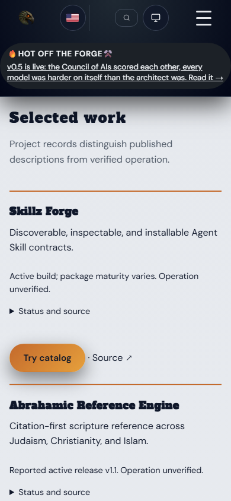
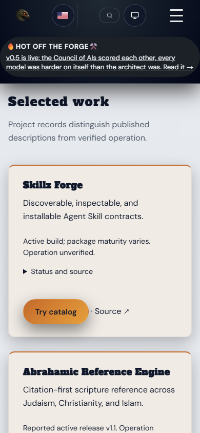

# Choose the phone presentation

Both are rendered proposals. Neither is applied to the public site. Accepted
MurderBird art, the motto and existing destinations are preserved. Both show
A11's source-described project maturity and explicit unknown delivery, with one
primary action per project card. A12 Featured wording and A15 optional Contact
prompts are included.

The architect's refinement is applied to both alternatives: visitor descriptions
come first, followed by a concise maturity/uncertainty line. "Status and source"
opens the full dated registry record. Prototype and uncertain-operation limits
remain visible; provenance has not been deleted or rewritten. This is a
refinement of the existing pending comparison, not a new selection request.

**Recommendation: A, compact project rows.** Its lower card height makes it
easier to scan the evidence on a phone. B retains more visual separation and
places featured writing ahead of the longer orientation section. This is a
design recommendation, not measured visitor preference.

| A: Compact project rows | B: Editorial cards |
| --- | --- |
|  |  |

| Surface | A | B |
| --- | --- | --- |
| Phone homepage | [Screenshot](../audit/screenshots/a14-phone-proposals/a-home-390.png) | [Screenshot](../audit/screenshots/a14-phone-proposals/b-home-390.png) |
| Desktop selected work | [Screenshot](../audit/screenshots/a14-phone-proposals/a-selected-1280.png) | [Screenshot](../audit/screenshots/a14-phone-proposals/b-selected-1280.png) |
| Desktop project shelf | [Screenshot](../audit/screenshots/a14-phone-proposals/a-projects-1280.png) | [Screenshot](../audit/screenshots/a14-phone-proposals/b-projects-1280.png) |
| Phone Skillz detail | [Screenshot](../audit/screenshots/a14-phone-proposals/a-projects-skillz-390.png) | [Screenshot](../audit/screenshots/a14-phone-proposals/b-projects-skillz-390.png) |
| Phone Contact | [Screenshot](../audit/screenshots/a14-phone-proposals/a-contact-390.png) | [Screenshot](../audit/screenshots/a14-phone-proposals/b-contact-390.png) |
| Expanded source disclosure | [Screenshot](../audit/screenshots/a14-phone-proposals/a-status-open-390.png) | [Screenshot](../audit/screenshots/a14-phone-proposals/b-status-open-390.png) |

At 390px, both restore a 16px heading gutter, place practical links at y585 to
y681, and bring selected work from baseline y2332 to y1026. Forty-three scoped
browser samples passed. These measurements include the visible proposal notice;
they are not conversion or human task-success evidence.

**Existing decision remains pending:** A, B, or an owner-directed revision.
Selection authorizes preparation of that direction, not a claim that full
accessibility, human task acceptance or production release checks are complete.
A21 retains integration and release ownership.

For interaction, run the dedicated loopback server described in the
[complete proposal report](a14-phone-proposals-2026-09-07.md), then open
[A](http://127.0.0.1:5145/proposals/a/) or
[B](http://127.0.0.1:5145/proposals/b/). The report contains the full screenshot
matrix, exact source contracts, checks, limitations and reproduction commands.
