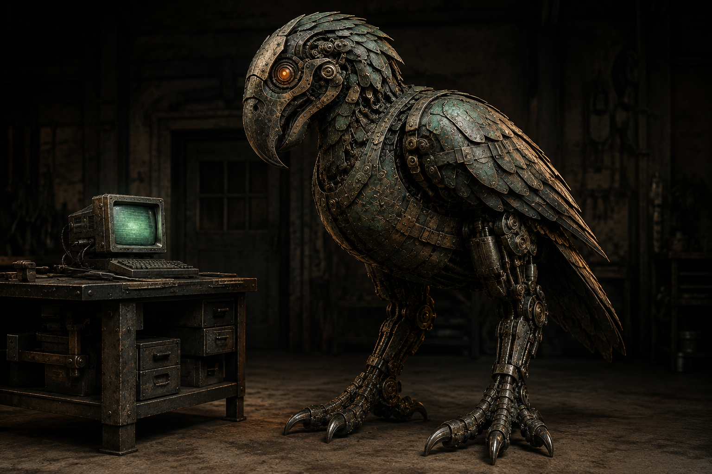
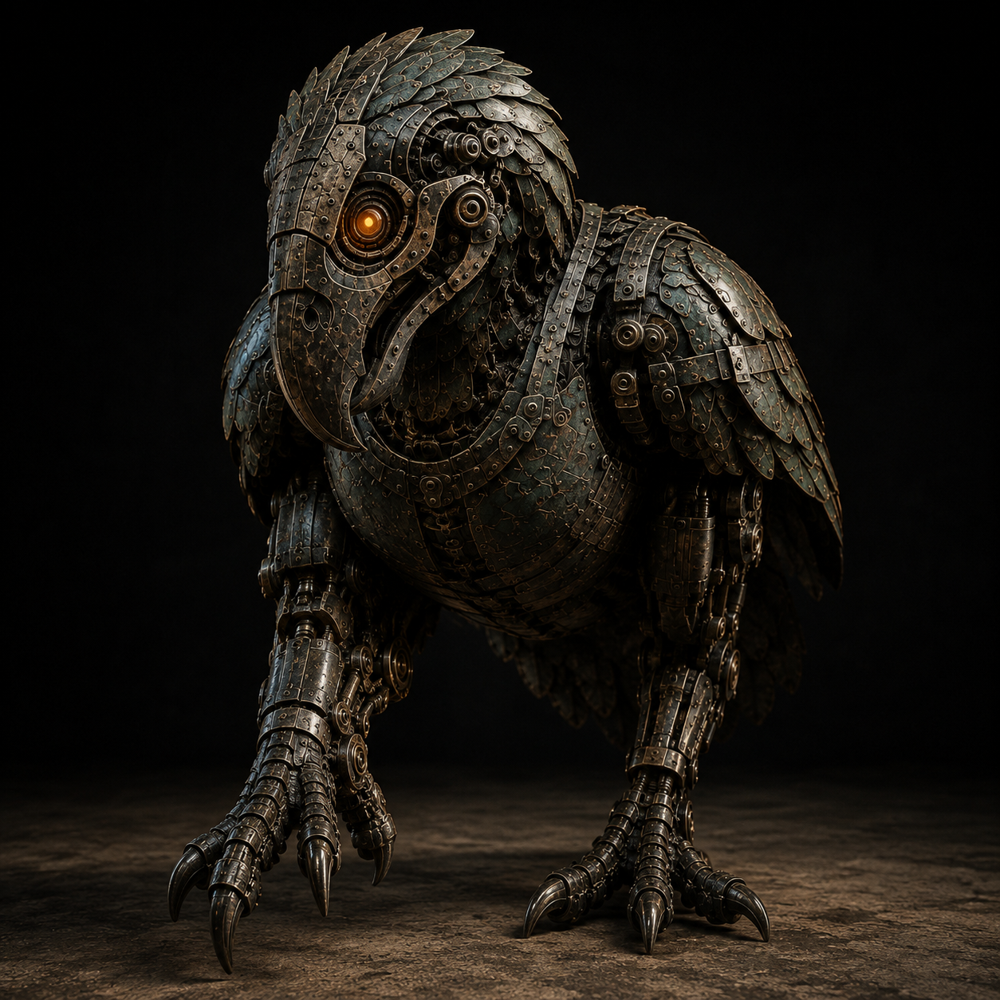
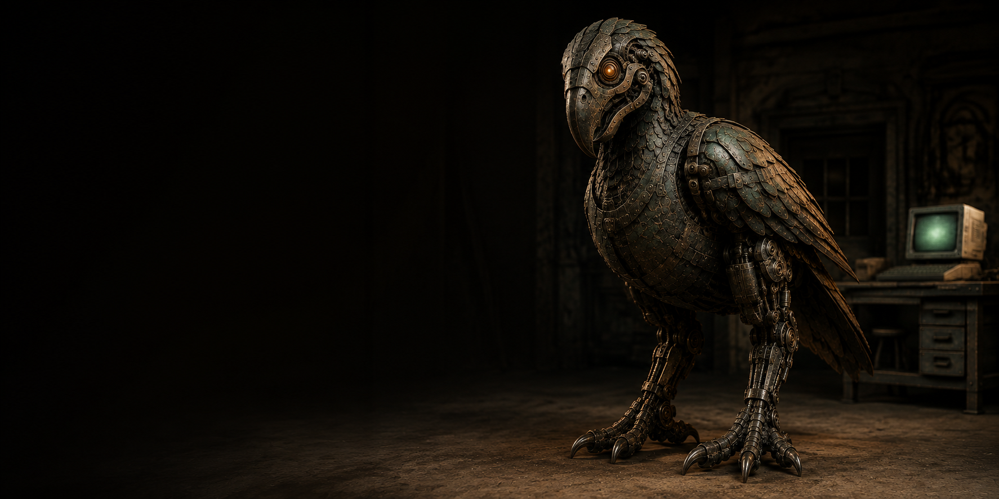
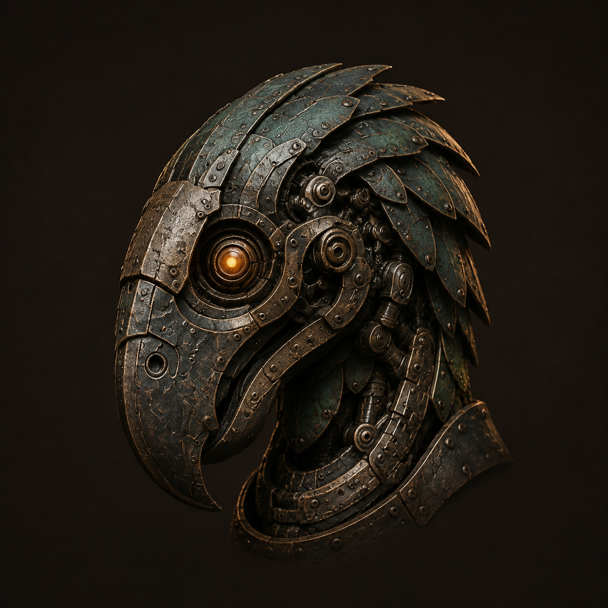
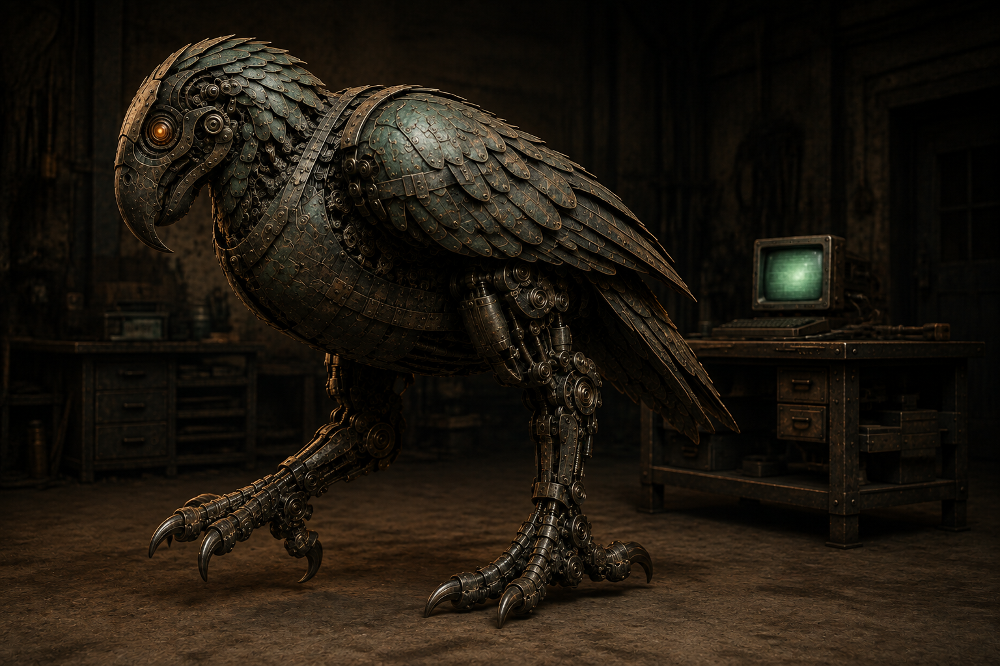
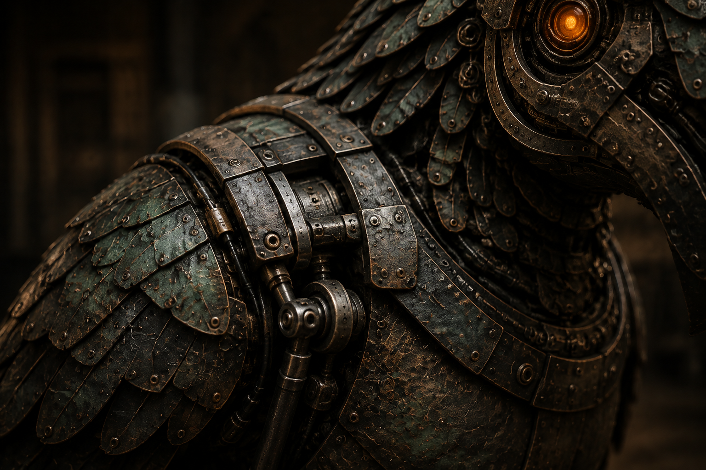
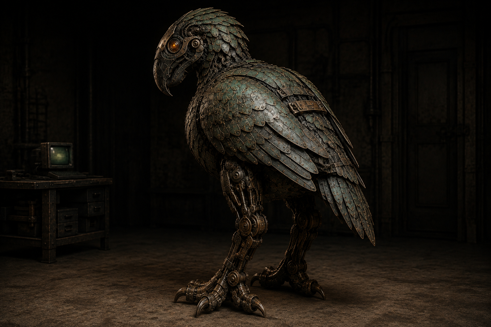
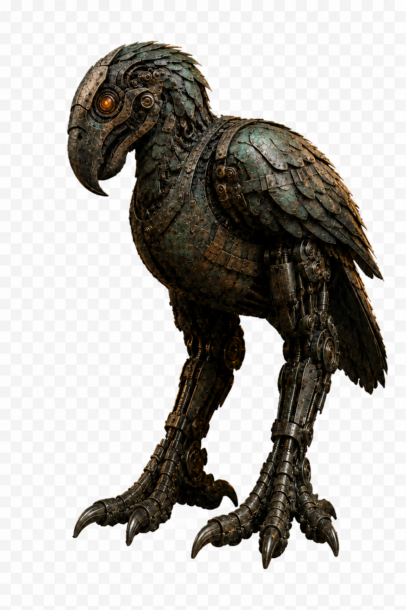

# MurderBird human-scale image library: batch 1

Date: 2026-09-06
Status: Candidate library, not published or committed by this task. Seven usable opaque studies plus one rejected cutout attempt retained for provenance. This begins the wider asset program; it does not complete platform exports, historical-era scenes, animation, or website integration.

## Canon and scope

Working fictional scale: approximately 2 meters upright. The standard bench and CRT establish relative scale, not an engineering measurement. Current story source is site-src/pages/writings/murderbird/index.main.html. The newest story deliberately combines fossil-inspired ground-bearing anatomy with an eagle-emblem bill and ornamental wings. Preserve that hybrid rather than replacing the head with a blunt fossil reconstruction. Story eras: ancient handmade bronze; 1853 rediscovery; 1873 industrial reconstruction; 2025 concealed onboard heart and learning mind. Current story supersedes older seamless-alien-shell prompts.

All outputs use built-in image generation, guided by imagegen and okhp3-overkill-hill-brand profile 1.1.0. No paid external tools, Blender renders, video, or sound were used. Blender 5.2.1 LTS was verified installed by a worker, but no existing model or rig was found in the repository. Two workers supplied consumer inventory and continuity review.

Initial head/material reference: assets/img/library/murderbird-story-sentinel-portrait-2026-09-06.png. This earlier reference's tabletop scale is explicitly superseded. Subsequent images reference the new floor master. No existing live assets, story paragraphs, or historical manifesto imagery were changed.

## Review findings

- Floor master and profile establish significantly larger scale through floor contacts and normal bench-mounted CRT. Exact height is an art-direction target, not proven by perspective.
- Head identity, orange lens, dark bronze and green patina carry across the set. Individual plate layouts and repair straps vary; these are related character studies, not rig-consistent animation frames.
- Wings and tail still appear longer than the compact target in some views. Restrained fold asymmetry is not definitively established in every image. Do not call mechanical anatomy validated.
- Head avatar is detailed and exceeds the requested central safe region. It is NOT an approved maskable icon or a readable 16-pixel favicon. Use a purpose-built simplification before platform export.
- Social hero is 1774 x 887, not a final 1200 x 630 export. Left-side negative space is intentional; no generated text means it can support multiple languages.
- Transparent request and one targeted correction both returned RGB with painted checkerboard and corner alpha 255. The retained standing candidate is rejected for transparent use. No false alpha claim.
- Shoulder detail is an interpretive illustration of layered repairs, not a reproducible component blueprint.
- All seven usable images are opaque. No responsive WebP, ICO, Apple, Android, or maskable variants were produced in this batch.

## Asset catalog

### floor-master



- File: assets/img/library/murderbird-floor-master-landscape-1536-2026-09-06.png
- Measured size: 1536 x 1024; image/png; 2350513 bytes; Format24bppRgb; no alpha.
- SHA-256: E371AA650D1AD0F1CDD8CFE41281FD70BA0D94B71808BF9CC3313009D21F4C29
- Status: candidate-awaiting-review.
- Draft en-US alt text: A large bronze MurderBird stands on the workshop floor beside a workbench holding a green CRT monitor.

### camera-advance



- File: assets/img/library/murderbird-camera-advance-square-1254-2026-09-06.png
- Measured size: 1254 x 1254; image/png; 2251407 bytes; Format24bppRgb; no alpha.
- SHA-256: DCE2772586E68243B22DCE0EE9B06A472872E174A1B85DC24FF8300AAC51486F
- Status: candidate-awaiting-review.
- Draft en-US alt text: The bronze MurderBird advances toward the viewer, lifting one broad mechanical foot while the other supports its weight.

### social-hero



- File: assets/img/library/murderbird-social-hero-wide-1774-2026-09-06.png
- Measured size: 1774 x 887; image/png; 1661639 bytes; Format24bppRgb; no alpha.
- SHA-256: 262D7B211A59C1200B4C63E8379048715074FBBA74E80AA13B01C3FA7FCDAFF7
- Status: candidate-awaiting-review.
- Draft en-US alt text: A floor-standing bronze MurderBird watches from the right of a dark workshop, with a small CRT on a bench behind it.

### head-avatar



- File: assets/img/library/murderbird-head-avatar-square-1254-2026-09-06.png
- Measured size: 1254 x 1254; image/png; 2198883 bytes; Format24bppRgb; no alpha.
- SHA-256: 82411A8198B9266690BB40DE4E4657A76A3149EF631886A1EA1625A878B7638D
- Status: candidate-awaiting-review.
- Draft en-US alt text: Close portrait of the MurderBird's hooked bronze bill, layered crown, and orange circular eye.

### profile-stride



- File: assets/img/library/murderbird-profile-stride-landscape-1536-2026-09-06.png
- Measured size: 1536 x 1024; image/png; 2324507 bytes; Format24bppRgb; no alpha.
- SHA-256: C4007FCF57BEE2122C86C879D1DB65BA7094EB984AD65A9ED5D24119DAE87DB0
- Status: candidate-awaiting-review.
- Draft en-US alt text: The MurderBird takes a deliberate step across the workshop floor beside a bench-mounted CRT.

### repair-detail



- File: assets/img/library/murderbird-repair-detail-landscape-1536-2026-09-06.png
- Measured size: 1536 x 1024; image/png; 2374470 bytes; Format24bppRgb; no alpha.
- SHA-256: 01CC3CE39F1EC0F9EB1F759F2C4E214EACAE70C9705BDA879769C5B4D9C3E0B6
- Status: candidate-awaiting-review.
- Draft en-US alt text: Close view of weathered bronze shoulder plates, a repair bracket, and exposed mechanical joints beneath an orange eye.

### rear-view



- File: assets/img/library/murderbird-rear-view-landscape-1536-2026-09-06.png
- Measured size: 1536 x 1024; image/png; 2235857 bytes; Format24bppRgb; no alpha.
- SHA-256: 0FBCFC39FBBB832DDFBF9DBA4E080E2D964B1EAE186D499E0F0A01F781A86998
- Status: candidate-awaiting-review.
- Draft en-US alt text: Rear three-quarter view of the bronze MurderBird standing on the floor with its head turned toward the viewer.

### transparent-standing



- File: assets/img/library/murderbird-standing-cutout-candidate-portrait-1024-2026-09-06.png
- Measured size: 1024 x 1536; image/png; 2030914 bytes; Format24bppRgb; no alpha.
- SHA-256: C1D5A36EB682FC88A2430D6A5E6670DF88A5AF2B6224F87132F01FA9BC2E3192
- Status: rejected-for-transparency.
- Draft en-US alt text: A full-body bronze MurderBird standing against a painted checkerboard background.


## Portable metadata

This internal JSON is a candidate catalog, not deployed structured data. Rights and public URLs are intentionally not asserted. Use the placement plan for OG/Twitter/ImageObject fields and exact consumer mapping.

```json
{
  "schema_version": 1,
  "series": "murderbird-human-scale-2026-09-06",
  "publication_status": "not-deployed",
  "fictional_scale_meters": 2,
  "scale_status": "working-art-direction",
  "generation_method": "built-in-image-generation",
  "assets": [
    {
      "id": "floor-master",
      "path": "assets/img/library/murderbird-floor-master-landscape-1536-2026-09-06.png",
      "width": 1536,
      "height": 1024,
      "bytes": 2350513,
      "sha256": "E371AA650D1AD0F1CDD8CFE41281FD70BA0D94B71808BF9CC3313009D21F4C29",
      "alt_en_us": "A large bronze MurderBird stands on the workshop floor beside a workbench holding a green CRT monitor.",
      "status": "candidate-awaiting-review",
      "alpha": false,
      "mime_type": "image/png",
      "era": "2025"
    },
    {
      "id": "camera-advance",
      "path": "assets/img/library/murderbird-camera-advance-square-1254-2026-09-06.png",
      "width": 1254,
      "height": 1254,
      "bytes": 2251407,
      "sha256": "DCE2772586E68243B22DCE0EE9B06A472872E174A1B85DC24FF8300AAC51486F",
      "alt_en_us": "The bronze MurderBird advances toward the viewer, lifting one broad mechanical foot while the other supports its weight.",
      "status": "candidate-awaiting-review",
      "alpha": false,
      "mime_type": "image/png",
      "era": "2025"
    },
    {
      "id": "social-hero",
      "path": "assets/img/library/murderbird-social-hero-wide-1774-2026-09-06.png",
      "width": 1774,
      "height": 887,
      "bytes": 1661639,
      "sha256": "262D7B211A59C1200B4C63E8379048715074FBBA74E80AA13B01C3FA7FCDAFF7",
      "alt_en_us": "A floor-standing bronze MurderBird watches from the right of a dark workshop, with a small CRT on a bench behind it.",
      "status": "candidate-awaiting-review",
      "alpha": false,
      "mime_type": "image/png",
      "era": "2025"
    },
    {
      "id": "head-avatar",
      "path": "assets/img/library/murderbird-head-avatar-square-1254-2026-09-06.png",
      "width": 1254,
      "height": 1254,
      "bytes": 2198883,
      "sha256": "82411A8198B9266690BB40DE4E4657A76A3149EF631886A1EA1625A878B7638D",
      "alt_en_us": "Close portrait of the MurderBird's hooked bronze bill, layered crown, and orange circular eye.",
      "status": "candidate-awaiting-review",
      "alpha": false,
      "mime_type": "image/png",
      "era": "2025"
    },
    {
      "id": "profile-stride",
      "path": "assets/img/library/murderbird-profile-stride-landscape-1536-2026-09-06.png",
      "width": 1536,
      "height": 1024,
      "bytes": 2324507,
      "sha256": "C4007FCF57BEE2122C86C879D1DB65BA7094EB984AD65A9ED5D24119DAE87DB0",
      "alt_en_us": "The MurderBird takes a deliberate step across the workshop floor beside a bench-mounted CRT.",
      "status": "candidate-awaiting-review",
      "alpha": false,
      "mime_type": "image/png",
      "era": "2025"
    },
    {
      "id": "repair-detail",
      "path": "assets/img/library/murderbird-repair-detail-landscape-1536-2026-09-06.png",
      "width": 1536,
      "height": 1024,
      "bytes": 2374470,
      "sha256": "01CC3CE39F1EC0F9EB1F759F2C4E214EACAE70C9705BDA879769C5B4D9C3E0B6",
      "alt_en_us": "Close view of weathered bronze shoulder plates, a repair bracket, and exposed mechanical joints beneath an orange eye.",
      "status": "candidate-awaiting-review",
      "alpha": false,
      "mime_type": "image/png",
      "era": "2025"
    },
    {
      "id": "rear-view",
      "path": "assets/img/library/murderbird-rear-view-landscape-1536-2026-09-06.png",
      "width": 1536,
      "height": 1024,
      "bytes": 2235857,
      "sha256": "0FBCFC39FBBB832DDFBF9DBA4E080E2D964B1EAE186D499E0F0A01F781A86998",
      "alt_en_us": "Rear three-quarter view of the bronze MurderBird standing on the floor with its head turned toward the viewer.",
      "status": "candidate-awaiting-review",
      "alpha": false,
      "mime_type": "image/png",
      "era": "2025"
    },
    {
      "id": "transparent-standing",
      "path": "assets/img/library/murderbird-standing-cutout-candidate-portrait-1024-2026-09-06.png",
      "width": 1024,
      "height": 1536,
      "bytes": 2030914,
      "sha256": "C1D5A36EB682FC88A2430D6A5E6670DF88A5AF2B6224F87132F01FA9BC2E3192",
      "alt_en_us": "A full-body bronze MurderBird standing against a painted checkerboard background.",
      "status": "rejected-for-transparency",
      "alpha": false,
      "mime_type": "image/png",
      "era": "2025"
    }
  ]
}
```

## Story continuity corrections pending

The live authoring source still includes scale-conflicting text. Proposed changes, not applied here: pressure line follows bird across workshop floor instead of bench; lifting sling instead of hand beneath breast; crossing workshop floor instead of workbench; stopping beside workbench and lowering head toward CRT; workshop floor bears weight instead of computer casing. The original sigil remains explicitly historical. Resolve these with story ownership before deploying revised literal narrative illustrations.

## Exact prompts

### floor-master

```text
Photorealistic fictional MurderBird automaton for OverKill Hill. Identity: preserve reference curved heavy hooked bill, swept segmented crown, round restrained orange optical lens; NOT modern eagle anatomy. Human-scale terrestrial terror bird, 2 meters tall upright, massive compact torso, thick muscular-mechanical thighs and strong shins, broad weight-bearing three-forward-toed feet, compact S-curved thick neck, short folded nonflight wings and short tail. No gangly neck, no long eagle flight feathers. Armor is hammered ancient bronze with irregular flattened peened pins, black-brown water patina, deep green seams and tiny blue mineral recesses. Functional 1873 black iron braces, brass bushings, steel linkages and pressure cylinders. Subtle insulated modern wiring along tendon paths and tiny strain sensors; sealed heart inside breast and mind inside head, no visible reactor or hose. Anatomical left shoulder retains slightly uneven twice-fitted plate under iron repair strap and restricted wing fold. Intelligent watchful sentinel of workmanship, latent force, no mindless rage. Crisp lifelike practical creature photography, clear metal microtexture and believable load-bearing joints. Restrained forge amber, espresso and deep patina green, no neon cyberpunk, smoke, text, logos, watermarks or organic feathers.
Reference image is HEAD AND MATERIAL identity only. Completely replace its small tabletop scale and perching composition. New master: landscape 3:2 full-body 3/4 view of bird with BOTH feet firmly on workshop FLOOR. Beside bird is ordinary waist-high 90cm industrial workbench; tabletop intersects bird at upper thigh/lower torso, NEVER under its feet. An ordinary 35cm tall green-phosphor CRT and keyboard sit ON that bench, CRT top well below bird's shoulder. Bird crown reaches nearly the lintel of ordinary 2.1m doorway visible far behind in soft focus. Bird is about 5.7 times the CRT's physical height. Head gently lowered toward screen but still tall. No humans necessary. Compose bird on right two thirds, small bench on left, spare dark workshop backdrop, controlled studio-like key light, full head and feet uncropped. Monumental but real heavy ground predator, not giant CGI eagle.
```

### camera-advance

```text
Photorealistic fictional MurderBird automaton for OverKill Hill. Identity: preserve reference curved heavy hooked bill, swept segmented crown, round restrained orange optical lens; NOT modern eagle anatomy. Human-scale terrestrial terror bird, 2 meters tall upright, massive compact torso, thick muscular-mechanical thighs and strong shins, broad weight-bearing three-forward-toed feet, compact S-curved thick neck, short folded nonflight wings and short tail. No gangly neck, no long eagle flight feathers. Armor is hammered ancient bronze with irregular flattened peened pins, black-brown water patina, deep green seams and tiny blue mineral recesses. Functional 1873 black iron braces, brass bushings, steel linkages and pressure cylinders. Subtle insulated modern wiring along tendon paths and tiny strain sensors; sealed heart inside breast and mind inside head, no visible reactor or hose. Anatomical left shoulder retains slightly uneven twice-fitted plate under iron repair strap and restricted wing fold. Intelligent watchful sentinel of workmanship, latent force, no mindless rage. Crisp lifelike practical creature photography, clear metal microtexture and believable load-bearing joints. Restrained forge amber, espresso and deep patina green, no neon cyberpunk, smoke, text, logos, watermarks or organic feathers.
Input image is the new floor-standing identity and scale master. Preserve character identity and materials, change camera and pose as follows:
Square full-body low-camera frontal three-quarter action portrait. Same bird advancing purposefully toward lens, one broad foot braced on concrete, other in mid-step reaching toward camera, toes separated, head lowered with intent, beak slightly parted. Camera feels threatened by heavy mass. Folded short wings balance subtly, left more restricted. No flying leap. No CRT, no desk, no props, simple near-black studio space and floor contact shadow. Full head and feet inside safe margin. Not a tabletop miniaturization.
```

### social-hero

```text
Photorealistic fictional MurderBird automaton for OverKill Hill. Identity: preserve reference curved heavy hooked bill, swept segmented crown, round restrained orange optical lens; NOT modern eagle anatomy. Human-scale terrestrial terror bird, 2 meters tall upright, massive compact torso, thick muscular-mechanical thighs and strong shins, broad weight-bearing three-forward-toed feet, compact S-curved thick neck, short folded nonflight wings and short tail. No gangly neck, no long eagle flight feathers. Armor is hammered ancient bronze with irregular flattened peened pins, black-brown water patina, deep green seams and tiny blue mineral recesses. Functional 1873 black iron braces, brass bushings, steel linkages and pressure cylinders. Subtle insulated modern wiring along tendon paths and tiny strain sensors; sealed heart inside breast and mind inside head, no visible reactor or hose. Anatomical left shoulder retains slightly uneven twice-fitted plate under iron repair strap and restricted wing fold. Intelligent watchful sentinel of workmanship, latent force, no mindless rage. Crisp lifelike practical creature photography, clear metal microtexture and believable load-bearing joints. Restrained forge amber, espresso and deep patina green, no neon cyberpunk, smoke, text, logos, watermarks or organic feathers.
Input image is the new floor-standing identity and scale master. Preserve character identity and materials, change camera and pose as follows:
Wide 2:1 horizontal website/social hero. Bird full body standing on floor at right, head turned toward viewer; ordinary 90cm workbench with 35cm green CRT in background right provides scale, clearly not a perch. LEFT 42 percent is clean nearly-black espresso negative space for future HTML heading, absolutely NO generated text. Clean full silhouette and measured amber rim, details readable without excessive darkness. No new objects.
```

### head-avatar

```text
Photorealistic fictional MurderBird automaton for OverKill Hill. Identity: preserve reference curved heavy hooked bill, swept segmented crown, round restrained orange optical lens; NOT modern eagle anatomy. Human-scale terrestrial terror bird, 2 meters tall upright, massive compact torso, thick muscular-mechanical thighs and strong shins, broad weight-bearing three-forward-toed feet, compact S-curved thick neck, short folded nonflight wings and short tail. No gangly neck, no long eagle flight feathers. Armor is hammered ancient bronze with irregular flattened peened pins, black-brown water patina, deep green seams and tiny blue mineral recesses. Functional 1873 black iron braces, brass bushings, steel linkages and pressure cylinders. Subtle insulated modern wiring along tendon paths and tiny strain sensors; sealed heart inside breast and mind inside head, no visible reactor or hose. Anatomical left shoulder retains slightly uneven twice-fitted plate under iron repair strap and restricted wing fold. Intelligent watchful sentinel of workmanship, latent force, no mindless rage. Crisp lifelike practical creature photography, clear metal microtexture and believable load-bearing joints. Restrained forge amber, espresso and deep patina green, no neon cyberpunk, smoke, text, logos, watermarks or organic feathers.
Input image is the new floor-standing identity and scale master. Preserve character identity and materials, change camera and pose as follows:
Square sculptural head-and-upper-neck brand portrait on flat espresso background, no scenery/CRT. Same hooked bill, swept segmented crown, restrained circular orange eye, deep green ancient patina and visible fine bronze repairs. Camera three-quarter side with face turned slightly toward viewer. Simplify microdetails and emphasize four to six broad crown forms and clear hooked silhouette for recognizable app/avatar source. Keep entire head and bill within centered 65 percent of canvas (safe circular crop), substantial quiet margins. No letters, no border. Do not pretend full-body scale can be proven in a head crop.
```

### profile-stride

```text
Photorealistic fictional MurderBird automaton for OverKill Hill. Identity: preserve reference curved heavy hooked bill, swept segmented crown, round restrained orange optical lens; NOT modern eagle anatomy. Human-scale terrestrial terror bird, 2 meters tall upright, massive compact torso, thick muscular-mechanical thighs and strong shins, broad weight-bearing three-forward-toed feet, compact S-curved thick neck, short folded nonflight wings and short tail. No gangly neck, no long eagle flight feathers. Armor is hammered ancient bronze with irregular flattened peened pins, black-brown water patina, deep green seams and tiny blue mineral recesses. Functional 1873 black iron braces, brass bushings, steel linkages and pressure cylinders. Subtle insulated modern wiring along tendon paths and tiny strain sensors; sealed heart inside breast and mind inside head, no visible reactor or hose. Anatomical left shoulder retains slightly uneven twice-fitted plate under iron repair strap and restricted wing fold. Intelligent watchful sentinel of workmanship, latent force, no mindless rage. Crisp lifelike practical creature photography, clear metal microtexture and believable load-bearing joints. Restrained forge amber, espresso and deep patina green, no neon cyberpunk, smoke, text, logos, watermarks or organic feathers.
Reference is identity master, not edit target. Landscape 3:2 left-side full-body profile mid-stride across workshop floor. Same large bird, short folded wings, one foot lifting clear and other planted with convincing heavy weight transfer. Entire silhouette sharp, all feet/crown uncropped. A standard waist-high bench with small CRT softly visible behind bird, no perch. Camera at human waist height, watchful lowered head, nearly closed hooked bill. Emphasize visible thigh and ankle mechanical load path, no giant long tail.
```

### repair-detail

```text
Photorealistic fictional MurderBird automaton for OverKill Hill. Identity: preserve reference curved heavy hooked bill, swept segmented crown, round restrained orange optical lens; NOT modern eagle anatomy. Human-scale terrestrial terror bird, 2 meters tall upright, massive compact torso, thick muscular-mechanical thighs and strong shins, broad weight-bearing three-forward-toed feet, compact S-curved thick neck, short folded nonflight wings and short tail. No gangly neck, no long eagle flight feathers. Armor is hammered ancient bronze with irregular flattened peened pins, black-brown water patina, deep green seams and tiny blue mineral recesses. Functional 1873 black iron braces, brass bushings, steel linkages and pressure cylinders. Subtle insulated modern wiring along tendon paths and tiny strain sensors; sealed heart inside breast and mind inside head, no visible reactor or hose. Anatomical left shoulder retains slightly uneven twice-fitted plate under iron repair strap and restricted wing fold. Intelligent watchful sentinel of workmanship, latent force, no mindless rage. Crisp lifelike practical creature photography, clear metal microtexture and believable load-bearing joints. Restrained forge amber, espresso and deep patina green, no neon cyberpunk, smoke, text, logos, watermarks or organic feathers.
Reference is identity master, not edit target. Landscape 3:2 macro editorial detail of ANATOMICAL LEFT SHOULDER and lower side of neck of same automaton, part of familiar orange eye and crown visible at upper right to anchor identity. Visually show three eras in a few inches: irregular twice-fitted hammered bronze plate, edge slightly misaligned but functional; dark iron Victorian repair strap bolted to underlying support, precisely machined brass bushing and working steel connecting rod; tiny ceramic-isolated modern strain sensor and protected fine wiring routed alongside ancient pins. Rich green/black patina in untouched recesses with polished contact crescent at bearing only. Realistic macro photography, readable geometry, no diagram labels, no exploded view, no opened glowing core. Tight detail image, not new anatomical design.
```

### rear-view

```text
Photorealistic fictional MurderBird automaton for OverKill Hill. Identity: preserve reference curved heavy hooked bill, swept segmented crown, round restrained orange optical lens; NOT modern eagle anatomy. Human-scale terrestrial terror bird, 2 meters tall upright, massive compact torso, thick muscular-mechanical thighs and strong shins, broad weight-bearing three-forward-toed feet, compact S-curved thick neck, short folded nonflight wings and short tail. No gangly neck, no long eagle flight feathers. Armor is hammered ancient bronze with irregular flattened peened pins, black-brown water patina, deep green seams and tiny blue mineral recesses. Functional 1873 black iron braces, brass bushings, steel linkages and pressure cylinders. Subtle insulated modern wiring along tendon paths and tiny strain sensors; sealed heart inside breast and mind inside head, no visible reactor or hose. Anatomical left shoulder retains slightly uneven twice-fitted plate under iron repair strap and restricted wing fold. Intelligent watchful sentinel of workmanship, latent force, no mindless rage. Crisp lifelike practical creature photography, clear metal microtexture and believable load-bearing joints. Restrained forge amber, espresso and deep patina green, no neon cyberpunk, smoke, text, logos, watermarks or organic feathers.
Reference image anchors exact character identity. New full-body rear three-quarter view looking past bird's anatomical left shoulder, head turned so the one orange optic and hooked profile are visible. Broad hips, short overlapping folded ornamental wings, left shoulder repair visible, short tail, sturdy grounded legs. Entire silhouette contained. Bird dominates, a normal workbench and small CRT barely visible to side establish human scale. Simple dark background and concrete floor. Landscape 3:2. No scene clutter.
```

### transparent-standing

```text
Photorealistic fictional MurderBird automaton for OverKill Hill. Identity: preserve reference curved heavy hooked bill, swept segmented crown, round restrained orange optical lens; NOT modern eagle anatomy. Human-scale terrestrial terror bird, 2 meters tall upright, massive compact torso, thick muscular-mechanical thighs and strong shins, broad weight-bearing three-forward-toed feet, compact S-curved thick neck, short folded nonflight wings and short tail. No gangly neck, no long eagle flight feathers. Armor is hammered ancient bronze with irregular flattened peened pins, black-brown water patina, deep green seams and tiny blue mineral recesses. Functional 1873 black iron braces, brass bushings, steel linkages and pressure cylinders. Subtle insulated modern wiring along tendon paths and tiny strain sensors; sealed heart inside breast and mind inside head, no visible reactor or hose. Anatomical left shoulder retains slightly uneven twice-fitted plate under iron repair strap and restricted wing fold. Intelligent watchful sentinel of workmanship, latent force, no mindless rage. Crisp lifelike practical creature photography, clear metal microtexture and believable load-bearing joints. Restrained forge amber, espresso and deep patina green, no neon cyberpunk, smoke, text, logos, watermarks or organic feathers.
Reference image anchors exact character identity. Create a genuinely transparent-background RGBA PNG cutout of this same full-body bird standing firmly in a three-quarter view, isolated subject only. Remove ALL scenery, floor, workbench, CRT and shadows outside subject. No painted checkerboard, no solid color backdrop. Portrait composition, entire crown and both feet uncropped. Preserve human-scale heavy proportions of reference, same identity and restrained orange optic. No new pose props; no perching.
```

### transparent-standing-correction

```text
Edit target: last supplied standing MurderBird image. Remove the painted checkerboard background completely and output actual transparent RGBA PNG with background alpha zero. Preserve the bird's pixels, anatomy, head, orange eye, bronze surfaces, feet and pose. No checkerboard pixels, no white or gray background. This is background extraction only, no restyling, no shadow.
```

